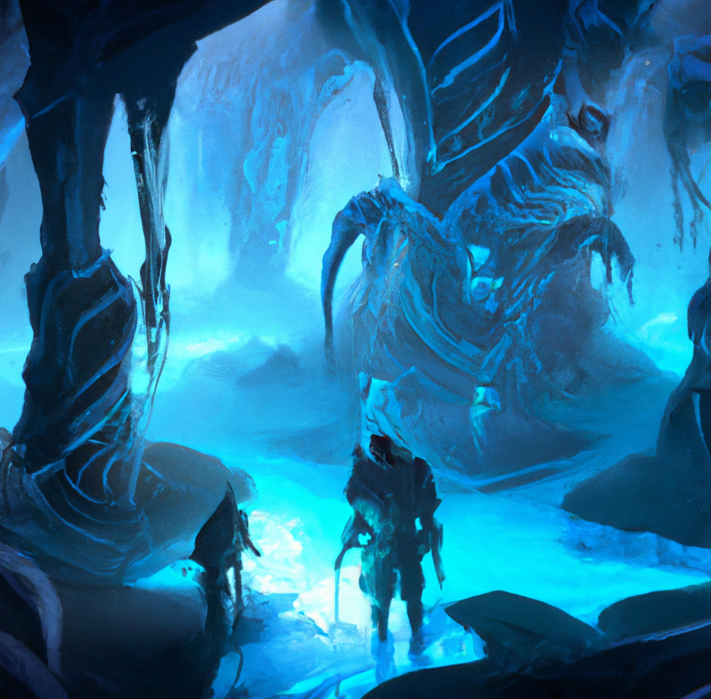

<h1 align="center">
    </br>
    
    </br>
    Discord D&D Bot / Game
    </br>
</h1>

<p align="center">
    <a href=""> <!-- TODO -->
        
    </a>
    <a href="https://github.com/nextcord/nextcord">
        
    </a>
    <a href="https://github.com/esoviscode/discord-bot/actions/workflows/docker-publish.yml">
        
    </a>
</p>

<h3 align="center">
    <a href="">🔗 Invite the bot</a>
    &nbsp;&nbsp;•&nbsp;&nbsp;
    <a href="">📖 Wiki</a>
</h3>

# Overview

This is the main repository for the Discord D&D Game Master Bot project.

The principal concept behind it is to open up an opportunity to play a game
similar to Dungeons & Dragons with your friends directly on Discord - without
the aid of any external apps or installations.

</br>
Below you will find some information on running the bot locally

## Table of contents

- [Overview](#overview)
  - [Table of contents](#table-of-contents)
  - [Prerequisites](#prerequisites)
- [Setup](#setup)
- [Usage](#usage)

## Prerequisites

- `python 3.8` or higher
- `docker`

# Setup

> Note: This guide assumes the [database server](https://github.com/esoviscode/database) is up and running.

<!--  These instructions should set up the project so that it is ready for 
development and testing purposes -->

1. Clone the repository and `cd` into the main directory
2. Create a file which will contain all environment variables (secrets)
   ```shell
   touch .env
   ```
   Exemplary `.env` file contents, with all available variables:
   ```
   BOT_TOKEN=qwertyuiop         # Discord bot access token
   DB_NAME=dndbot               # Postgres database name
   DB_ADDRESS=127.0.0.1         # Database server IP address
   DB_PORT=1234
   DB_USER=user                 # Authentication
   DB_PASSWORD=some_password
   ```
   > You will need to provide some correct values here, of course.
3. Getting the docker image
   
   Here you can either:
   - Use a prepared image
     ```
     docker pull ghcr.io/esoviscode/discord-bot:latest
     ```
    - Build one from local sources:
     ```
     docker build . -t dndbot-dev
     ```

# Usage

> Note: This guide assumes the docker image name is `ghcr.io/esoviscode/discord-bot:latest`

Run the bot:
```
docker run -d --env-file .env ghcr.io/esoviscode/discord-bot:latest
```
> This will run the `python` app in the background (`-d`), utilizing environment
variables provided in `.env` (`--env-file`)

</br>

After a few seconds the bot should be online, you can test if it works correctly
by running `/hello` on Discord.

You can see if something went wrong using:
```
docker logs <app name>
```
> Name of the app can be found using `docker container ls`


<!-- # Acknowledgments -->


